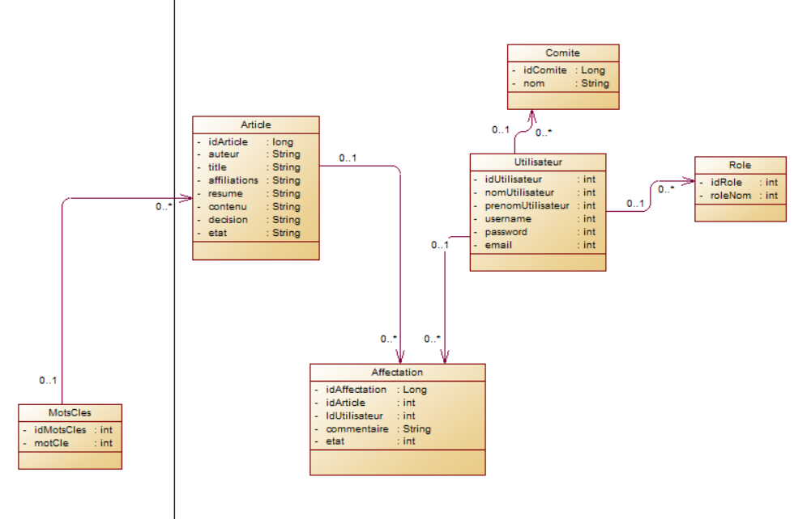

# Projet Gestion logiciel

## Cahier des charges:+1:

- La publication d’un article scientifique fait partie intégrante du travail d’un chercheur scientifique. Ce genre de publication est nécessaire pour : Faire valider l’intérêt des résultats et leur qualité scientifique, diffuser les résultats de recherche, et archiver la connaissance scientifique.
Une revue scientifique est une publication périodique d’un ensemble de travaux de recherche. Elle a pour fonction de faire connaître des travaux de recherche originaux ou de fond, Elle se distingue ainsi, des revues destinées à la vulgarisation, par sa rigueur.
Ainsi La publication, d’un article scientifique dans une telle revue, suit un processus d’évaluation avant qu’il soit mis en publication. 
Pour l’évaluation des travaux de recherches en vue de publication, une revue utilise une évaluation par les pairs (ou peer review). Chaque article subi une forme d'examen de la rigueur de la méthode scientifique employée et des résultats obtenus. Cet examen est fait par d’autres chercheurs qui jugent de façon critique les travaux d'autres chercheurs (leurs « pairs »).  Ainsi chaque article scientifique doit faire l'objet d'une critique attentive par un nombre restreint d'experts (ou referees) nommés par le comité éditorial de la revue scientifique.
Une revue applique une politique d'examen par les pairs, dite en double anonymat, ou double blind. Cela signifie que les experts jugeant un article ne connaissent pas l'identité de l'auteur ou des auteurs de l’article encours d’évaluation, et les auteurs ne connaissent pas l’identité de leurs referees. 

### Processus de publication
- L’auteur d’une publication dépose auprès du comité éditorial d’une revue les informations suivante : Titre de l’article, coordonnées de l’auteur correspondant, Co-auteurs, Affiliations, Résumé, Mots‐clés et le contenu sous forme de manuscrit de l’article à publier.
Le comité éditorial vérifie les informations fournies par l’auteur et la conformité du manuscrit avec sa politique éditoriale.
Par la suite Le comité adresse le manuscrit à trois referees différents en vue d’évaluation. En aucun cas les referees ne doivent pas savoir les noms de l’auteur correspondant ni des co-auteurs au moment de l’évaluation. Les auteurs ne doivent pas être informés des referees. Chaque referee évalue l’article, et enregistre ses commentaires sur l’article.
Le referee qualifie l’article comme suit :
  -	Accepté tel quel
  -	Accepté si modifications apportées
  -	Refus
- Le comité éditorial, suite aux rapports des referees, décide d’accepter ou de refuser la publication de l’article.
  -	Accepté tel quel
  -	Accepté après modifications apportées
  -	Demande de modifications avec engagement de publication
  -	Refus
  -	Refus car ne concerne pas la revue

- En vue de fiabiliser la communication entre les différents intervenants dans le processus d’évaluation et de publication, On souhaite concevoir une plateforme qui permet aux :
  -	Auteurs de déposer leur travaux de recherche en vue de publication et suivre l’état de son article.
  -	Comité éditorial de faire le suivi d’évaluation et de publication.
  -	Referees de faire le peer reviewing.
 
### Donner l’api REST sécurisée qui :
  :white_check_mark:	permet à un utilisateur non authentifié de visualisé les informations réduites sur la liste des articles déjà publiés –pas celles encours de publication- dans la revue : auteur, co-auteur, résumé et mots clés.
      ( Sélectionner par nom d’auteur ou Sélectionner par mots clés ) .
  :white_check_mark:	permet à un utilisateur authentifié de visualiser l’ensemble du contenu y compris le manuscrit de toutes les publications.
  :white_check_mark:	permet à un auteur authentifié d’ajouter un article en vue de publication, de pouvoir modifier ou totalement supprimer ses informations tant que le processus d’évaluation n’a pas encore commencé pour cet article.
  :white_check_mark:	permet à un auteur authentifié de suivre l’état de son article encours.
  :white_check_mark:	permet à un auteur d’un article encours d’évaluation de visualiser les rapports des différents referees sans savoir leurs identités.
  :white_check_mark:	Avant toute évaluation, le comité éditorial vérifie la conformité de l’article avec la politique de la revue.
  :white_check_mark:	permet au comité éditorial d’affecter l’évaluation d’un article à des referees.
  :white_check_mark:	permet à un referee d’évaluer un article et d’enregistrer ces commentaires.
  :white_check_mark:	permet au comité éditorial de qualifier un article pour publication ou non.

## Diagramme de classe :+1: 
